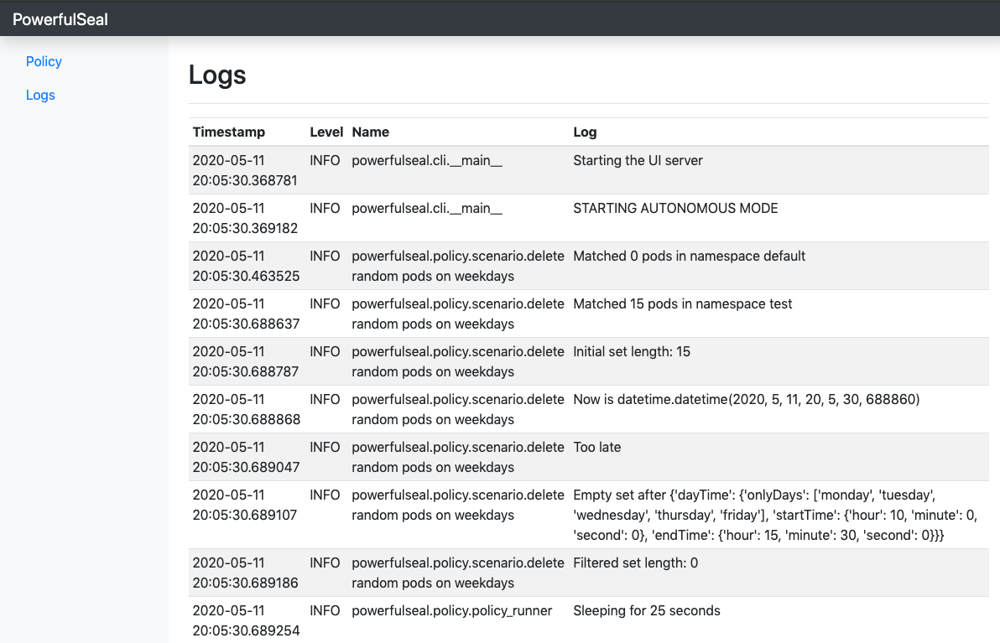

# PowerfulSeal [](https://travis-ci.org/bloomberg/powerfulseal) [](https://pypi.python.org/pypi/powerfulseal)

__PowerfulSeal__ adds chaos to your Kubernetes clusters, so that you can detect problems in your systems as early as possible. It kills targeted pods and takes VMs up and down.


It follows the [Principles of Chaos Engineering](http://principlesofchaos.org/), and is inspired by [Chaos Monkey](https://github.com/Netflix/chaosmonkey). [Watch the Seal at KubeCon 2017 Austin](https://youtu.be/00BMn0UjsG4).

Embrace the inevitable failure. __Embrace The Seal__.


## On the menu

- [Highlights](#highlights)
- [Introduction](#introduction)
- [Modes of operation](#modes-of-operation)
  - [Interactive mode](#interactive-mode)
  - [Autonomous mode](#autonomous-mode)
    - [Metrics Collection](#metrics-collection)
    - [Web user interface](#web-user-interface)
    - [Writing policies](#writing-policies)
  - [Label mode](#label-mode)
  - [Demo mode](#demo-mode)
- [Setup](#setup)
  - [Minikube setup](#minikube-setup)
- [Getting started](#getting-started)
- [Testing](#testing)
- [Read about the PowerfulSeal](#read-about-the-powerfulseal)
- [FAQ](#faq)
- [Footnotes](#footnotes)

## Highlights

- works with `OpenStack`, `AWS` and local machines
- speaks `Kubernetes` natively
- interactive and autonomous, policy-driven mode
- web interface to interact with PowerfulSeal
- metric collection and exposition to `Prometheus`
- minimal setup, easy yaml-based policies
- easy to extend


## Introduction

__PowerfulSeal__ works in several modes:

- __Interactive__ mode is designed to allow you to discover your cluster's components and manually break things to see what happens. It operates on nodes, pods, deployments and namespaces.

- __Autonomous__ mode reads a policy file, which can contain any number of pod and node scenarios. Each scenario describes a list of matches, filters and actions to execute on your cluster, and will be executed in a loop.

- __Label__ mode allows you to specify which pods to kill with a small number of options by adding `seal/` labels to pods. This is a more imperative alternative to autonomous mode.  

- __Demo__ mode allows you to point the Seal at a cluster and a `heapster` server and let it try to figure out what to kill based on the resource utilisation.

## Modes of operation

## Interactive mode

```sh
$ seal interactive --help
usage: seal interactive [-h] --kubeconfig KUBECONFIG
                        (--openstack | --aws | --no-cloud)
                        [--openstack-cloud-name OPENSTACK_CLOUD_NAME]
                        (-i INVENTORY_FILE | --inventory-kubernetes)
                        [--remote-user REMOTE_USER]
                        [--ssh-allow-missing-host-keys]
                        [--ssh-path-to-private-key SSH_PATH_TO_PRIVATE_KEY]

optional arguments:
  -h, --help            show this help message and exit

Kubernetes settings:
  --kubeconfig KUBECONFIG
                        Location of kube-config file

Cloud settings:
  --openstack           use OpenStack cloud provider
  --aws                 use AWS cloud provider
  --no-cloud            don't use cloud provider
  --openstack-cloud-name OPENSTACK_CLOUD_NAME
                        optional name of the open stack cloud from your config
                        file to use

Inventory settings:
  -i INVENTORY_FILE, --inventory-file INVENTORY_FILE
                        the inventory file of groups of hosts to work with
  --inventory-kubernetes
                        reads all kubernetes cluster nodes as inventory

SSH settings:
  --remote-user REMOTE_USER
                        the of the user for the ssh connections
  --ssh-allow-missing-host-keys
                        Allow connection to hosts not present in known_hosts
  --ssh-path-to-private-key SSH_PATH_TO_PRIVATE_KEY
                        Path to ssh private key
```


Here's a sneak peek of what you can do in the interactive mode:


## Autonomous mode

Autonomous reads the scenarios to execute from the policy file, and runs them:

1. The matches are combined together and deduplicated to produce an initial working set
2. They are run through a series of filters
3. For all the items remaining after the filters, all actions are executed

```sh
$ seal autonomous --help
usage: seal autonomous [-h] --kubeconfig KUBECONFIG
                       (--openstack | --aws | --no-cloud)
                       [--openstack-cloud-name OPENSTACK_CLOUD_NAME]
                       (-i INVENTORY_FILE | --inventory-kubernetes)
                       [--remote-user REMOTE_USER]
                       [--ssh-allow-missing-host-keys]
                       [--ssh-path-to-private-key SSH_PATH_TO_PRIVATE_KEY]
                       --policy-file POLICY_FILE
                       [--stdout-collector | --prometheus-collector]
                       [--prometheus-host PROMETHEUS_HOST]
                       [--prometheus-port PROMETHEUS_PORT] [--headless]
                       [--host HOST] [--port PORT]

optional arguments:
  -h, --help            show this help message and exit

Kubernetes settings:
  --kubeconfig KUBECONFIG
                        Location of kube-config file

Cloud settings:
  --openstack           use OpenStack cloud provider
  --aws                 use AWS cloud provider
  --no-cloud            don't use cloud provider
  --openstack-cloud-name OPENSTACK_CLOUD_NAME
                        optional name of the open stack cloud from your config
                        file to use

Inventory settings:
  -i INVENTORY_FILE, --inventory-file INVENTORY_FILE
                        the inventory file of groups of hosts to work with
  --inventory-kubernetes
                        reads all kubernetes cluster nodes as inventory

SSH settings:
  --remote-user REMOTE_USER
                        the of the user for the ssh connections
  --ssh-allow-missing-host-keys
                        Allow connection to hosts not present in known_hosts
  --ssh-path-to-private-key SSH_PATH_TO_PRIVATE_KEY
                        Path to ssh private key

Policy settings:
  --policy-file POLICY_FILE
                        the policy file to run

Metrics settings:
  --stdout-collector    print metrics collected to stdout
  --prometheus-collector
                        store metrics in Prometheus and expose metrics over a
                        HTTP server

Prometheus settings:
  --prometheus-host PROMETHEUS_HOST
                        Host to expose Prometheus metrics via the HTTP server
                        when using the --prometheus-collector flag
  --prometheus-port PROMETHEUS_PORT
                        Port to expose Prometheus metrics via the HTTP server
                        when using the --prometheus-collector flag

Web UI settings:
  --headless            Doesn't start the UI, just runs the policy
  --host HOST           Specify host for the PowerfulSeal web server
  --port PORT           Specify port for the PowerfulSeal web server
```

### Metrics collection

Autonomous mode also comes with the ability for metrics useful for monitoring to be collected. PowerfulSeal currently has a `stdout` and Prometheus collector. However, metric collectors are easily extensible so it is easy to add your own. More details can be found [here](METRICS.md).

### Web User Interface

#### If you're not going to use the UI, use the flag `--headless` to disable it

PowerfulSeal comes with a web interface to help you navigate Autonomous Mode. Features include:

- starting/stopping autonomous mode
- viewing and filtering logs
- changing the configuration (either overwriting the remote policy file or copying the changes to clipboard)
- stopping/killing individual nodes and pods




### Writing policies

A minimal policy file, doing nothing, looks like this:

```yaml
config:
  minSecondsBetweenRuns: 77
  maxSecondsBetweenRuns: 100

nodeScenarios: []

podScenarios: [] 
```

A more interesting schema, that kills a random pod in `default` namespace every 1-30 seconds:

```yaml
config:
  minSecondsBetweenRuns: 1
  maxSecondsBetweenRuns: 30

nodeScenarios: []
podScenarios:
  - name: "delete random pods in default namespace"

    match:
      - namespace:
          name: "default"

    filters:
      - randomSample:
          size: 1

    actions:
      - kill:
          probability: 0.77
          force: true
```

A [full featured example](./tests/policy/example_config.yml) listing most of the available options can be found in the [tests](./tests/policy).

The schemas are validated against the [powerful JSON schema](./powerfulseal/policy/ps-schema.json).

## Label mode

Label mode is a more imperative alternative to autonomous mode, allowing you to specify which specific _per-pod_ whether a pod should be killed, the days/times it can be killed and the probability of it being killed.

To mark a pod for attack, do `kubectl label pods my-app-1 seal/enabled=true`, and the `Seal` will start attacking it, but only during working hours (defaults).

Instructions on how to use label mode can be found in [LABELS.md](LABELS.md).

```sh
$ seal label --help
usage: seal label [-h] --kubeconfig KUBECONFIG
                  (--openstack | --aws | --no-cloud)
                  [--openstack-cloud-name OPENSTACK_CLOUD_NAME]
                  (-i INVENTORY_FILE | --inventory-kubernetes)
                  [--remote-user REMOTE_USER] [--ssh-allow-missing-host-keys]
                  [--ssh-path-to-private-key SSH_PATH_TO_PRIVATE_KEY]
                  [--kubernetes-namespace KUBERNETES_NAMESPACE]
                  [--min-seconds-between-runs MIN_SECONDS_BETWEEN_RUNS]
                  [--max-seconds-between-runs MAX_SECONDS_BETWEEN_RUNS]
                  [--stdout-collector | --prometheus-collector]
                  [--prometheus-host PROMETHEUS_HOST]
                  [--prometheus-port PROMETHEUS_PORT]

optional arguments:
  -h, --help            show this help message and exit

Kubernetes settings:
  --kubeconfig KUBECONFIG
                        Location of kube-config file

Cloud settings:
  --openstack           use OpenStack cloud provider
  --aws                 use AWS cloud provider
  --no-cloud            don't use cloud provider
  --openstack-cloud-name OPENSTACK_CLOUD_NAME
                        optional name of the open stack cloud from your config
                        file to use

Inventory settings:
  -i INVENTORY_FILE, --inventory-file INVENTORY_FILE
                        the inventory file of groups of hosts to work with
  --inventory-kubernetes
                        reads all kubernetes cluster nodes as inventory

SSH settings:
  --remote-user REMOTE_USER
                        the of the user for the ssh connections
  --ssh-allow-missing-host-keys
                        Allow connection to hosts not present in known_hosts
  --ssh-path-to-private-key SSH_PATH_TO_PRIVATE_KEY
                        Path to ssh private key

Kubernetes options:
  --kubernetes-namespace KUBERNETES_NAMESPACE
                        Namespace to use for label and demo mode (set to blank
                        for all namespaces)

Policy settings:
  --min-seconds-between-runs MIN_SECONDS_BETWEEN_RUNS
                        Minimum number of seconds between runs
  --max-seconds-between-runs MAX_SECONDS_BETWEEN_RUNS
                        Maximum number of seconds between runs

Metrics settings:
  --stdout-collector    print metrics collected to stdout
  --prometheus-collector
                        store metrics in Prometheus and expose metrics over a
                        HTTP server

Prometheus settings:
  --prometheus-host PROMETHEUS_HOST
                        Host to expose Prometheus metrics via the HTTP server
                        when using the --prometheus-collector flag
  --prometheus-port PROMETHEUS_PORT
                        Port to expose Prometheus metrics via the HTTP server
                        when using the --prometheus-collector flag
```


## Demo mode

The main way to use PowerfulSeal is to write a policy file for Autonomous mode which reflects realistic failures in your system. However, PowerfulSeal comes with a demo mode to demonstrate how it can cause chaos on your Kubernetes cluster. Demo mode gets all the pods in the cluster, selects those which are using the most resources, then kills them based on a probability.

Demo mode requires [Heapster](https://github.com/kubernetes/heapster). To run demo mode, use the `demo` subcommand along with `--heapster-path` (path to heapster without a trailing slash, e.g., `http://localhost:8001/api/v1/namespaces-kube-system/services/heapster/proxy`). You can also optionally specify `--aggressiveness` (from `1` (weakest) to `5` (strongest)) inclusive, as well as `--[min/max]-seconds-between-runs`.

```sh
$ seal demo --help
usage: seal demo [-h] --kubeconfig KUBECONFIG
                 (--openstack | --aws | --no-cloud)
                 [--openstack-cloud-name OPENSTACK_CLOUD_NAME]
                 (-i INVENTORY_FILE | --inventory-kubernetes)
                 [--remote-user REMOTE_USER] [--ssh-allow-missing-host-keys]
                 [--ssh-path-to-private-key SSH_PATH_TO_PRIVATE_KEY]
                 [--kubernetes-namespace KUBERNETES_NAMESPACE]
                 [--min-seconds-between-runs MIN_SECONDS_BETWEEN_RUNS]
                 [--max-seconds-between-runs MAX_SECONDS_BETWEEN_RUNS]
                 [--stdout-collector | --prometheus-collector]
                 [--prometheus-host PROMETHEUS_HOST]
                 [--prometheus-port PROMETHEUS_PORT] --heapster-path
                 HEAPSTER_PATH [--aggressiveness AGGRESSIVENESS]

optional arguments:
  -h, --help            show this help message and exit

Kubernetes settings:
  --kubeconfig KUBECONFIG
                        Location of kube-config file

Cloud settings:
  --openstack           use OpenStack cloud provider
  --aws                 use AWS cloud provider
  --no-cloud            don't use cloud provider
  --openstack-cloud-name OPENSTACK_CLOUD_NAME
                        optional name of the open stack cloud from your config
                        file to use

Inventory settings:
  -i INVENTORY_FILE, --inventory-file INVENTORY_FILE
                        the inventory file of groups of hosts to work with
  --inventory-kubernetes
                        reads all kubernetes cluster nodes as inventory

SSH settings:
  --remote-user REMOTE_USER
                        the of the user for the ssh connections
  --ssh-allow-missing-host-keys
                        Allow connection to hosts not present in known_hosts
  --ssh-path-to-private-key SSH_PATH_TO_PRIVATE_KEY
                        Path to ssh private key

Kubernetes options:
  --kubernetes-namespace KUBERNETES_NAMESPACE
                        Namespace to use for label and demo mode (set to blank
                        for all namespaces)

Policy settings:
  --min-seconds-between-runs MIN_SECONDS_BETWEEN_RUNS
                        Minimum number of seconds between runs
  --max-seconds-between-runs MAX_SECONDS_BETWEEN_RUNS
                        Maximum number of seconds between runs

Metrics settings:
  --stdout-collector    print metrics collected to stdout
  --prometheus-collector
                        store metrics in Prometheus and expose metrics over a
                        HTTP server

Prometheus settings:
  --prometheus-host PROMETHEUS_HOST
                        Host to expose Prometheus metrics via the HTTP server
                        when using the --prometheus-collector flag
  --prometheus-port PROMETHEUS_PORT
                        Port to expose Prometheus metrics via the HTTP server
                        when using the --prometheus-collector flag

Heapster settings:
  --heapster-path HEAPSTER_PATH
                        Base path of Heapster without trailing slash
  --aggressiveness AGGRESSIVENESS
                        Aggressiveness of demo mode (default: 3)
```


## Setup

Setup includes:
- pointing PowerfulSeal at your Kubernetes cluster by giving it a Kubernetes config file
- pointing PowerfulSeal at your cloud by specifying the cloud driver to use and providing credentials
- making sure that PowerfulSeal can SSH into the nodes to execute commands on them
- writing a set of policies

These interactions are available:


### Minikube setup

It is possible to test a subset of Seal's functionality using a [`minikube`](https://kubernetes.io/docs/setup/minikube/) setup. 

To achieve that, please inspect the [Makefile](./Makefile). You will need to override the ssh host, specify the correct username and use minikube's ssh keys.


If you'd like to test out the interactive mode, start with this:

```sh
seal \
  -vv \
  interactive \
    --no-cloud \
    --inventory-kubernetes \
    --ssh-allow-missing-host-keys \
    --remote-user docker \
    --ssh-path-to-private-key `minikube ssh-key` \
    --override-ssh-host `minikube ip`
```

For label mode, try something like this:

```sh
seal \
  -vv \
  label \
    --no-cloud \
    --min-seconds-between-runs 3 \
    --max-seconds-between-runs 10 \
    --inventory-kubernetes \
    --ssh-allow-missing-host-keys \
    --remote-user docker \
    --ssh-path-to-private-key `minikube ssh-key` \
    --override-ssh-host `minikube ip`
```

For autonomous mode, this should get you started:

```sh
seal \
  -vv \
  autonomous \
    --no-cloud \
    --policy-file ./examples/policy_kill_random_default.yml \
    --inventory-kubernetes \
    --prometheus-collector \
    --prometheus-host 0.0.0.0 \
    --prometheus-port 9999 \
    --ssh-allow-missing-host-keys \
    --remote-user docker \
    --ssh-path-to-private-key `minikube ssh-key` \
    --override-ssh-host `minikube ip` \
    --host 0.0.0.0 \
    --port 30100
```


## Getting started

`PowerfulSeal` is available to install through pip:

```sh
pip install powerfulseal
powerfulseal --help # or seal --help
```

To start the web interface, use flags `--server --server-host [HOST] --server-port [PORT]` when starting PowerfulSeal in autonomous mode and visit the web server at `http://HOST:PORT/`.

Both Python 2.7 and Python 3 are supported.

## Testing

PowerfulSeal uses [tox](https://github.com/tox-dev/tox) to test with multiple versions on Python. The recommended setup is to install and locally activate the Python versions under `tox.ini` with [pyenv](https://github.com/pyenv/pyenv). 

Once the required Python versions are set up and can be discovered by tox (e.g., by having them discoverable in your PATH), you can run the tests by running `tox`.

For testing the web server and more details on testing, see [TESTING.md](TESTING.md). 

## Read about the PowerfulSeal

- https://www.techatbloomberg.com/blog/powerfulseal-testing-tool-kubernetes-clusters/
- https://siliconangle.com/blog/2017/12/17/bloomberg-open-sources-powerfulseal-new-tool-testing-kubernetes-clusters/
- https://github.com/ramitsurana/awesome-kubernetes#testing
- https://github.com/ramitsurana/awesome-kubernetes#other-useful-videos
- https://github.com/dastergon/awesome-chaos-engineering#notable-tools
- https://www.linux.com/news/powerfulseal-testing-tool-kubernetes-clusters-0
- https://www.infoq.com/news/2018/01/powerfulseal-chaos-kubernetes

## FAQ

### Where can I learn more about Chaos Engineering ?

We found these two links to be a good start:

- http://principlesofchaos.org/
- https://github.com/dastergon/awesome-chaos-engineering

### How is it different from Chaos Monkey ?

PowerfulSeal was inspired by Chaos Monkey, but it differs in a couple of important ways.

The Seal does:
  - speak Kubernetes
  - offer flexible, easy to write YAML scenarios
  - provide interactive mode with awesome tab-completion

The Seal doesn't:
  - need external dependencies (db, Spinnaker), apart from SSH, cloud and Kubernetes API access
  - need you to setup ```cron```

### Can I contribute to The Seal ?

We would love you to. In particular, it would be great to get help with:

- get more [cloud drivers](./powerfulseal/clouddrivers/driver.py) (currently `OpenStack` and `AWS`)
- get more [awesome filters](./powerfulseal/policy/scenario.py)
- <del>__get an amazing logo__</del>
- make the PowerfulSeal more powerful

Check out our [CONTRIBUTING.md](CONTRIBUTING.md) file for more information about how to contribute.

### Why a Seal ?

It might have been inspired by [this comic](https://randowis.com/2015/01/07/the-tower/).


## Footnotes

PowerfulSeal logo Copyright 2018 The Linux Foundation, and distributed under the Creative Commons Attribution (CC-BY-4.0) [license](https://creativecommons.org/licenses/by/4.0/legalcode).
