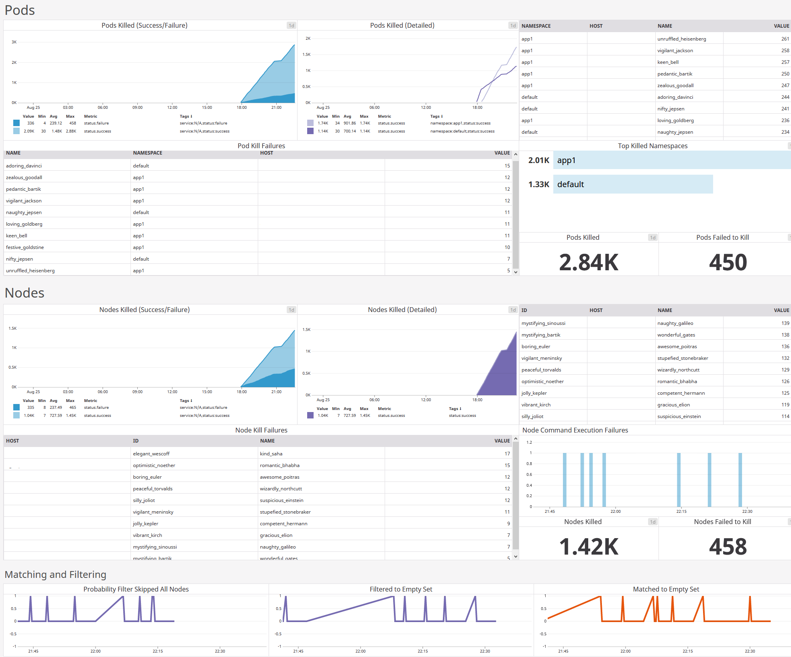

# In-depth topics
{: .no_toc }

## Table of contents
{: .no_toc .text-delta }

1. TOC
{:toc}

---


## Metric collection

### Description

The purpose of metric collection is to keep track of events which you may consider useful to be monitored (e.g., via Grafana). Three metric collectors have been implemented:

- StdoutCollector, a "no-op" collector which simply prints that an event has occurred to `stdout`
- PrometheusCollector, which sends metrics to the default Prometheus registry and exposes them via Prometheus internal web server
- DatadogCollector, which sends metrics to the [DogStatsD](https://docs.datadoghq.com/developers/dogstatsd/) aggregation service bundled with the Datadog Agent.

Like cloud drivers, metric collectors are extensible by subscribing to the `AbstractCollector` interface. Likewise, `AbstractCollector` makes it easy to add your own metrics.

The metric collectors collect the following events:

| Metric | Labels (Metadata) | Description | Justification |
| - | - | - | - |
| seal_pod_kills_total | status, namespace, name | Number of pods killed (including failures) | Example alerts include number of pod kills failing in the past five minutes or the ratio between successful and failed pod kills in a time range. If a pod cannot be killed, it could be an an unresponsive state or there may be a problem with keeping Kubernetes synchronised to the node. |
| seal_nodes_stopped_total | status, uid, name| Number of nodes killed (including failures) | Example alerts include number of node stops failing in the past five minutes or the ratio between successful and failed node stops. If a node cannot be stopped, it could be in an unresponsive state. |
| seal_execute_failed_total | uid, name | Tracks failure of command executions | Commands executions failing is a general case of errors which should be brought to the user's attention. |
| seal_empty_filter_total | N/A | Cases where filtering returns an empty result | If the user's policy is designed to model common levels of failures, then having no nodes/pods after filtering could mean that insufficient resources have been provisioned for the system to withstand failure. |
| seal_probability_filter_not_passed_total | N/A | Cases where the probability filter decides to skip all nodes | Useful to track long-term in order to ensure that probability distribution is as expected. |
| seal_empty_match_total | source (either `nodes` or `pods`) | Cases where matching returns an empty result | See `seal_empty_filter_total` |

### Usage

#### StdoutCollector (default)

To print metrics to `stdout`, use the `--stdout-collector` flag.

#### PrometheusCollector

To collect metrics, run PowerfulSeal with the `--prometheus-collector` flag, along with the `--prometheus-host` and `--prometheus-port` flags. Metrics will be exposed under a web server with URL `http://HOST:PORT/metrics`.

#### DatadogCollector

This collector relies on [DogStatsD](https://docs.datadoghq.com/developers/dogstatsd/) server (bundled with the [Datadog Agent](https://docs.datadoghq.com/agent/)), so a working instance is expected.

To collect metrics, run PowerfulSeal with the `--datadog-collector` flag.

### Use Case: Prometheus + Grafana + AlertManager

[](https://github.com/bloomberg/powerfulseal/blob/master/docs/media/grafana.png)

A common use case is to use a combination of Prometheus, Grafana and AlertManager in order to increase visibility of potential issues. 

In order to configure this integration, follow the steps below. (The below instructions assume that Prometheus and Grafana are already set up.)

1. Open your Prometheus configuration file (e.g., `/etc/prometheus/prometheus.yml`) and add a `scrape_configs` job with the host IP and a chosen port for the server PowerfulSeal will be run on:
    ```yaml
    scrape_configs:
    - job_name: powerfulseal
      scrape_interval: 5s
      scrape_timeout: 5s
      metrics_path: /metrics
      scheme: http
      static_configs:
      - targets:
        - [HOST]:[PORT]
        labels:
          name: powerfulseal
    ``` 
2. Add an alert file (e.g., `seal.alerts.yml`) to your Prometheus configuration path with your alerting rules ([example here](https://github.com/bloomberg/powerfulseal/blob/master/docs/examples/seal.alerts.yml))
3. Update `alertmanager.yml` to handle the alerting rules, for example:
    ```yaml
    global:
      resolve_timeout: 5m
    
    route:
      receiver: 'default'
      routes:
      - receiver: 'seal'
        match:
          type: seal
    
    # A list of notification receivers.
    receivers:
      - name: default
        email_configs:
    
      - name: seal
        email_configs:
    ```
4. Start PowerfulSeal with the `--prometheus-collector`, `--prometheus-host` and `--prometheus-port` flags, and restart Prometheus. Metrics should begin to appear.
5. Ensure Grafana has your Prometheus server added as a data source and create a new Grafana dashboard with the metrics ([example here](https://github.com/bloomberg/powerfulseal/blob/master/examples/docs/grafana.json) - note that the data source name may need to be changed)

### Use Case: Datadog

[](https://github.com/bloomberg/powerfulseal/blob/master/docs/media/datadog.png)

It's common to use Datadog in order to increase visibility of potential issues. 

In order to configure this properly, follow the steps below. (The below instructions assume that Datadog Agent is already set up.)

1. Start PowerfulSeal with the `--datadog-collector` flag. Metrics should begin to appear on Datadog.

2. Create a new dashboard with the collected metrics ([example here](https://github.com/bloomberg/powerfulseal/blob/master/examples/docs/datadog.json)).

3. Configure alerting with [Monitors](https://docs.datadoghq.com/monitors/), to give you the ability to know when critical changes are occurring.

## Inventory file
`PowerfulSeal` can use an ansible-style inventory file (in ini format)
```ini
[mygroup]
myhost01

[mygroup2]
myhost02

[some_hosts]
myhost01
myhost02
```

## Extend Powerfulseal

### Custom Metric Collectors 

### Custom Cloud Drivers 

### Custom Filters 