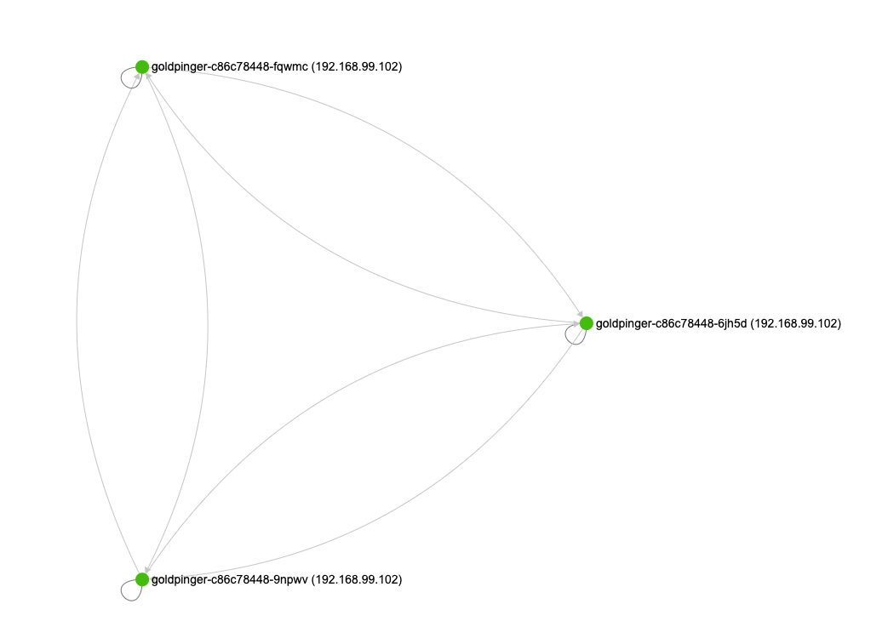
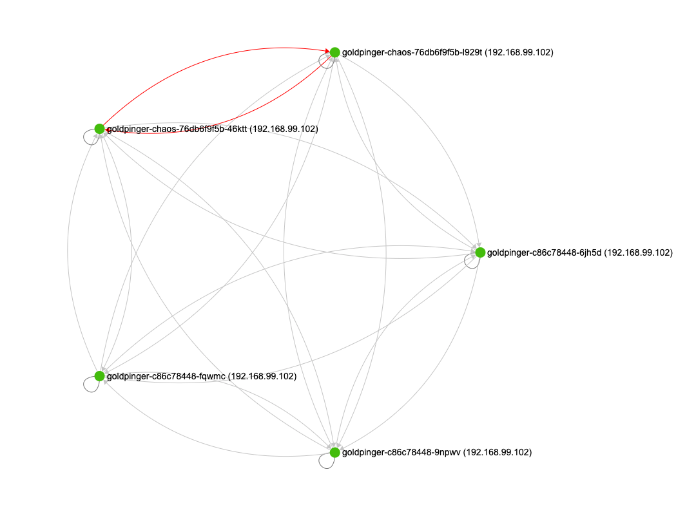
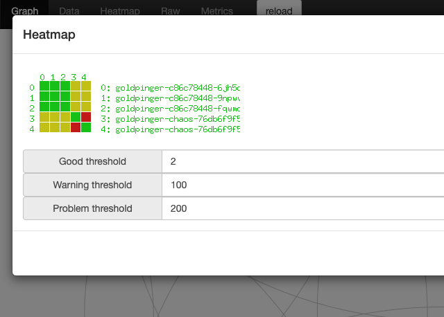

# Clone deployment and add slowness with tc
{: .no_toc }

## Table of contents
{: .no_toc .text-delta }

1. TOC
{:toc}

---

## Scenario

Imagine, that you have a deployment running on a cluster. You'd like to test how the deployment deals with slowness, but you don't want to disturb the existing software running. What do you do?

PowerfulSeal has you covered.

It can make a copy of your deployment for you, apply network slowness to the copy, do the validation you need, and then clean it up. All done automatically. Here's how it works.

## Setup

Imagine, that you are running [Goldpinger](https://github.com/bloomberg/goldpinger) on your cluster to test the connectivity. You might deploy it like this (straight from the readme):

```yaml
---
apiVersion: rbac.authorization.k8s.io/v1
kind: ClusterRole
metadata:
  name: goldpinger-clusterrole
rules:
- apiGroups:
  - ""
  resources:
  - pods
  verbs:
  - list
---
apiVersion: v1
kind: ServiceAccount
metadata:
  name: goldpinger-serviceaccount
  namespace: default
---
apiVersion: rbac.authorization.k8s.io/v1beta1
kind: ClusterRoleBinding
metadata:
  name: goldpinger-clusterrolebinding
roleRef:
  apiGroup: rbac.authorization.k8s.io
  kind: ClusterRole
  name: goldpinger-clusterrole
subjects:
  - kind: ServiceAccount
    name: goldpinger-serviceaccount
    namespace: default
---
apiVersion: apps/v1
kind: Deployment
metadata:
  name: goldpinger
  namespace: default
  labels:
    app: goldpinger
spec:
  replicas: 3
  selector:
    matchLabels:
      app: goldpinger
  template:
    metadata:
      labels:
        app: goldpinger
    spec:
      serviceAccount: "goldpinger-serviceaccount"
      containers:
      - name: goldpinger
        image: "docker.io/bloomberg/goldpinger:v3.0.0"
        env:
        - name: REFRESH_INTERVAL
          value: "2"
        - name: HOST
          value: "0.0.0.0"
        - name: PORT
          value: "8080"
        - name: POD_IP
          valueFrom:
            fieldRef:
              fieldPath: status.podIP
        ports:
        - containerPort: 8080
          name: http
---
apiVersion: v1
kind: Service
metadata:
  name: goldpinger
  namespace: default
  labels:
    app: goldpinger
spec:
  type: LoadBalancer
  ports:
    - port: 8080
      name: http
  selector:
    app: goldpinger
```

When you look it its graph, it looks like this:




## Scenario

Now, you can run PowerfulSeal, and ask it to clone and mutate the deployment. Let's say that we want to add 100ms delay to all network traffic, in both directions.

You can specify any command arguments you want.

:warning: be warned, that the tc command will be run in an init container, with `NET_ADMIN` capability added. Don't run a random image from the internet like the one in example below.

```yaml
config:
  runStrategy:
    runs: 1
scenarios:
- name: Clone and tc
  steps:
  - clone:
      source:
        deployment:
          name: goldpinger
          namespace: default
      replicas: 2
      mutations:
        - tc:
            command:
              - tc
            args:
              - qdisc
              - add
              - dev
              - eth0
              - root
              - netem
              - delay
              - 100ms
            image: gaiadocker/iproute2:latest
  # wait three minutes before cleaning up
  - wait:
      seconds: 180
```

When you run it (`seal autonomous --policy-file tc.yml`), PowerfulSeal will create a new deployment, that matches the same labels, so the goldpinger service will pick them up.


After the pods start, if you look at the graph again, you will see that the new pods are being pinged, and work (albeit slowly), but the total delay between two pods being slowed down is more than the timeout (defaults to 300ms), so the connectivity between the two mutated pods doesn't work.



You can confirm that by looking at the heatmap, and selecting 100ms as a warning threshold, and 300 as error:

