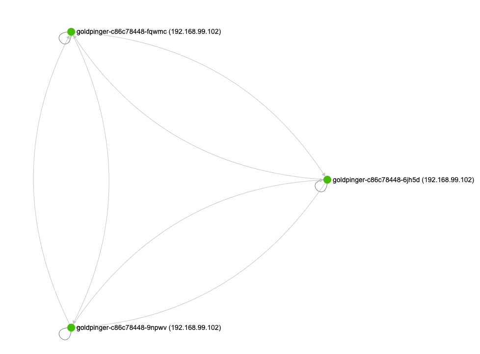
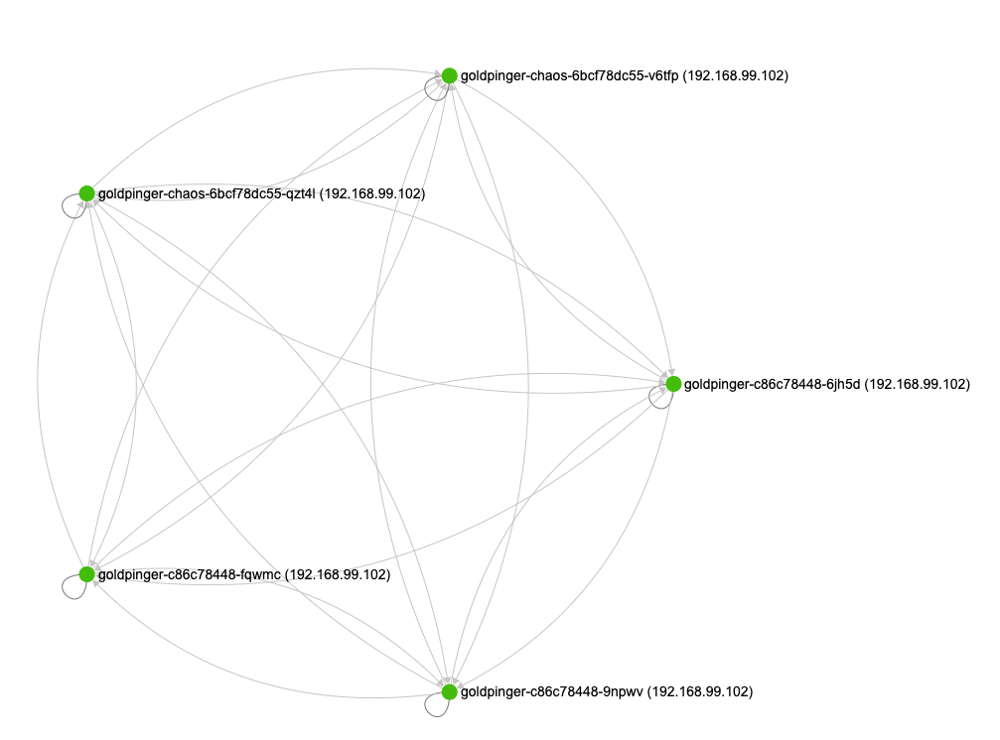
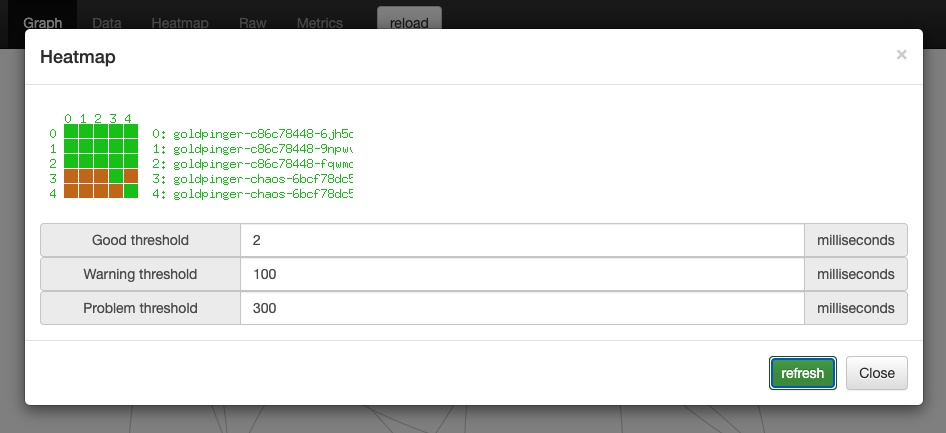

# Clone deployment and add slowness with tc
{: .no_toc }

## Table of contents
{: .no_toc .text-delta }

1. TOC
{:toc}

---

## Scenario

PowerfulSeal can make a copy of your deployment for you, apply network slowness to the copy, do the validation you need, and then clean it up. All done automatically.

It supports integrating with [toxiproxy](https://github.com/Shopify/toxiproxy). This is how it works:

- PowerfulSeal makes a copy of your target deployment
- inside the clone, it adds an extra side-car container running Toxiproxy
- for each port defined on your containers, it will configure a proxy called `auto<port number>`, so for example if you have a container running port 80, it will create a proxy called `auto80`
- it will use `iptables` to redirect all TCP traffic on that port 80 to the proxy running on a different port
- it will add any network issues you configure in the `toxics` list ([see available toxics](https://github.com/shopify/toxiproxy#toxics))

That takes care of the ingress proxying. If you'd also like to setup some proxies to remote destinations, configure them in `proxies` section. [Learn more](https://github.com/shopify/toxiproxy#2-populating-toxiproxy).

Let's see what that looks like on an example.

## Setup

Imagine, that you are running [Goldpinger](https://github.com/bloomberg/goldpinger) on your cluster to test the connectivity. You might deploy it like this (straight from the readme):

```yaml
---
apiVersion: rbac.authorization.k8s.io/v1
kind: ClusterRole
metadata:
  name: goldpinger-clusterrole
rules:
- apiGroups:
  - ""
  resources:
  - pods
  verbs:
  - list
---
apiVersion: v1
kind: ServiceAccount
metadata:
  name: goldpinger-serviceaccount
  namespace: default
---
apiVersion: rbac.authorization.k8s.io/v1beta1
kind: ClusterRoleBinding
metadata:
  name: goldpinger-clusterrolebinding
roleRef:
  apiGroup: rbac.authorization.k8s.io
  kind: ClusterRole
  name: goldpinger-clusterrole
subjects:
  - kind: ServiceAccount
    name: goldpinger-serviceaccount
    namespace: default
---
apiVersion: apps/v1
kind: Deployment
metadata:
  name: goldpinger
  namespace: default
  labels:
    app: goldpinger
spec:
  replicas: 3
  selector:
    matchLabels:
      app: goldpinger
  template:
    metadata:
      labels:
        app: goldpinger
    spec:
      serviceAccount: "goldpinger-serviceaccount"
      containers:
      - name: goldpinger
        image: "docker.io/bloomberg/goldpinger:v3.0.0"
        env:
        - name: REFRESH_INTERVAL
          value: "2"
        - name: HOST
          value: "0.0.0.0"
        - name: PORT
          value: "8080"
        - name: POD_IP
          valueFrom:
            fieldRef:
              fieldPath: status.podIP
        ports:
        - containerPort: 8080
          name: http
---
apiVersion: v1
kind: Service
metadata:
  name: goldpinger
  namespace: default
  labels:
    app: goldpinger
spec:
  type: LoadBalancer
  ports:
    - port: 8080
      name: http
  selector:
    app: goldpinger
```

When you look it its graph, it looks like this:




## Scenario

Now, you can run PowerfulSeal, and ask it to clone and mutate the deployment. Let's say that we want to add 100ms delay on the ingress traffic, on port 8080.

:warning: be warned, that the tc command will be run in an init container, with `NET_ADMIN` capability added. Don't run a random image from the internet like the one in example below.

Note, that the targetProxy is called `auto8080` - this is the automaticaly created proxy for port 8080 in the Goldpinger deployment.

```yaml
config:
  runStrategy:
    runs: 1
scenarios:
- name: Clone and tc
  steps:
  - clone:
      source:
        deployment:
          name: goldpinger
          namespace: default
      replicas: 2
      mutations:
        - toxiproxy:
            toxics:
              - targetProxy: auto8080
                toxicType: latency
                toxicAttributes:
                  - name: latency
                    value: 200

  # wait three minutes before cleaning up
  - wait:
      seconds: 180
```

When you run it (`seal autonomous --policy-file toxiproxy.yml`), PowerfulSeal will create a new deployment, that matches the same labels, so the goldpinger service will pick them up.


After the pods start, if you look at the graph again, you will see that the new pods are being pinged, and work (albeit slowly).



You can confirm that by looking at the heatmap, and selecting 100ms as a warning threshold, and 300 as error:

